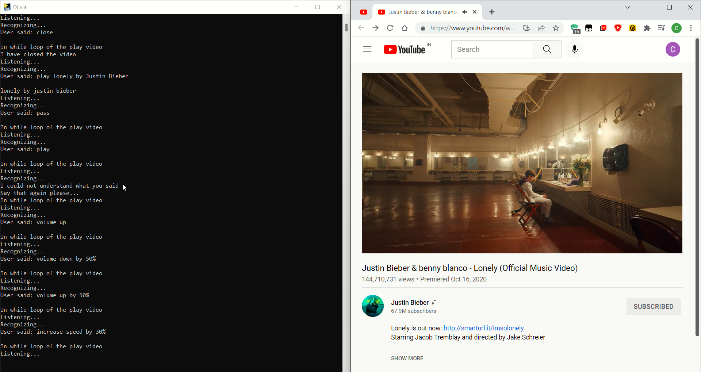

# Olivia

By Chirag Singhal

---

## Outline

- [Olivia](#olivia)
  - [Outline](#outline)
  - [Introduction](#introduction)
  - [Problem statement](#problem-statement)
  - [Aims and objectives](#aims-and-objectives)
  - [Methodology](#methodology)
  - [Problem Solution](#problem-solution)
  - [Result](#result)
  - [Utilization](#utilization)
  - [Work progress](#work-progress)
  - [References](#references)

---

## Introduction

The Olivia is personal virtual assistant.

This project is to create a personal assistant that can be used by anyone to perform basic tasks on computer and get answer to basic quires.

---

## Problem statement

The problem statement is that there is need of a virtual assistant that can understand English in Indian accent and work on desktop system.

---

## Aims and objectives

• The main aim of a voice assistant is to minimize the use of input devices.
• The Olivia Personal Assistant is a voice assistant that can be used to perform tasks like playing music, playing games, • playing videos, taking screenshots, sending emails, sending WhatsApp messages, etc.

---

• The Olivia saves the user time and energy by providing a variety of functions.
• The software is designed to be very useful for people with visual disabilities,physical disabilities like hand movements, hand-eye coordination, hand loss, etc.

---

## Methodology

• First of all, user will open the software by double-clicking on the executable file.
• Then the user will give the command or query to the software.
• The software will record the query as an audio file.
• We will use the speech recognition library to recognize the query.
• We will then check the query is recognized or not.

---

• If the query is not recognized then the software will ask the user to say the query again.
• Then when the query is recognized then the software will check the query using certain keywords.
• If the query is matched with the keywords, then the software will answer the query or do the required action.

---

Methodology

---

## Problem Solution

The software is developed using Python.

The libraries used in the software are Ctypes, DateTime, JSON, Math, OS, Platform, Random, Re, Shutil, Subprocess, Sys, Time, Tkinter, Webbrowser, Numpy, Psutil, PyAutoGui, Pyfiglet, Pyperclip, Pyttsx3, Pywhatkit, SpeechRecognition, Wikipedia, Winshell, Googletrans, and Pyowm.

---

## Result

The result expected from this project is a personal assistant that can be used by anyone. And it is able to perform most common tasks like playing music, playing games, playing videos, taking screenshots, sending emails, sending WhatsApp messages, etc.
and able to respond to the user's queries in a natural and comfortable way.

---

Play videos and perform tasks like play,pause,next,previous,volume up,volume down,mute,speed up,speed down,etc.

---

Open any website

---

Open word and make document

---

Translate

---

## Utilization

The utilization of this project is very simple. The user can use the application by simply speaking the voice commands. The application will then perform the task that the user has asked for. The utilization of this project is very crucial for the disabled people.

---

## Work progress

The future work scope of the project is beyond imagination. The project can incorporate more technologies like deep learning, artificial intelligence, machine learning, natural language processing, speech recognition, etc. in better ways like contextual voice enabled applications and provide a better user experience.

---

The project can also be used by people who are not able to use the keyboard or mouse in the future. The Olivia can improved to provide more personalized services to the user.

---

## References

1. [https://en.wikipedia.org/wiki/Siri](https://en.wikipedia.org/wiki/Siri)
2. G. O. Young, “Synthetic structure of industrial plastics (Book style with
   paper title and editor),” in Plastics, 2nd ed. vol. 3, J. Peters, Ed. New
   York: McGraw-Hill, 1964, pp. 15–64.
3. [https://en.wikipedia.org/wiki/Virtual_assistant](https://en.wikipedia.org/wiki/Virtual_assistant)
4. [https://python.org/downloads/release/cpython/](https://python.org/downloads/release/cpython/)
